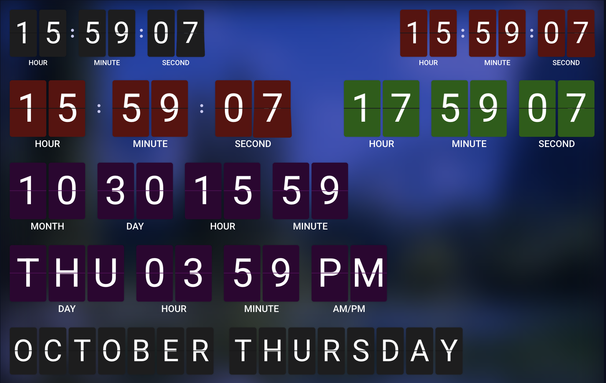
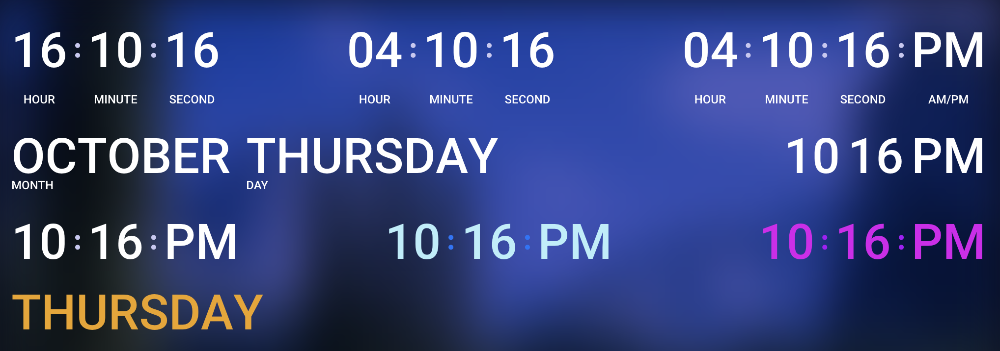

# @hakit/date-and-time

Date & time components for HAKIT dashboards: a flip-style (analog inspired) clock, a clean digital clock, and helpers for localized formatting. They pick up the user's Home Assistant locale and timezone automatically, so what you see matches the rest of your HA UI.

## Highlights

* Two clock styles: animated flip and minimalist digital.
* Uses Home Assistant user settings (language + timezone) for all date / time parts.
* Granular control over which units show: year, month, day, hour, minute, second, AM/PM.
* Flexible month/day name styles (2‑digit, short, long, narrow) without drowning you in config noise.
* Clean separator toggle (colons) and color theming; flip mode keeps the classic card divider.
* Labels (optional) underneath each group with automatic locale mapping (AM/PM strings cleaned of stray numerals).
* Efficient updates: digits change once per second without full React re-renders.

## Flip vs Digital

| Feature | Flip Clock | Digital Clock |
|---------|------------|---------------|
| Animation | Card flip each change | Static update |
| Card styling | Width, height, radius, divider color | Simplified (height + font size) |
| Per‑digit structure | Split top/bottom + front/back faces | Single span per digit |
| Labels | Supported | Supported |
| Separators | Colon dots (styled) | Colon dots (styled) |

## Screenshots

Flip clock:

Digital clock:

## More Resources

* [HAKIT Documentation](https://hakit.dev)
* [Home Assistant](https://home-assistant.io)
* [Module Federation](https://module-federation.io/)
* [React Documentation](https://react.dev)

